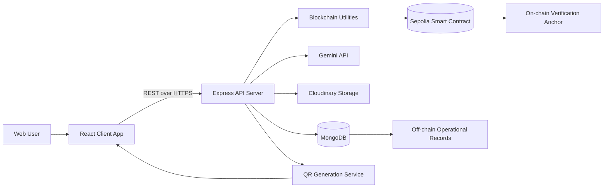
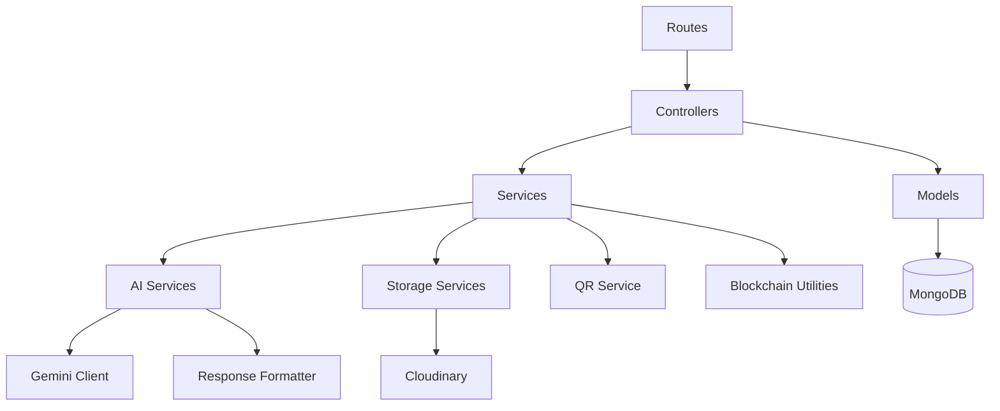
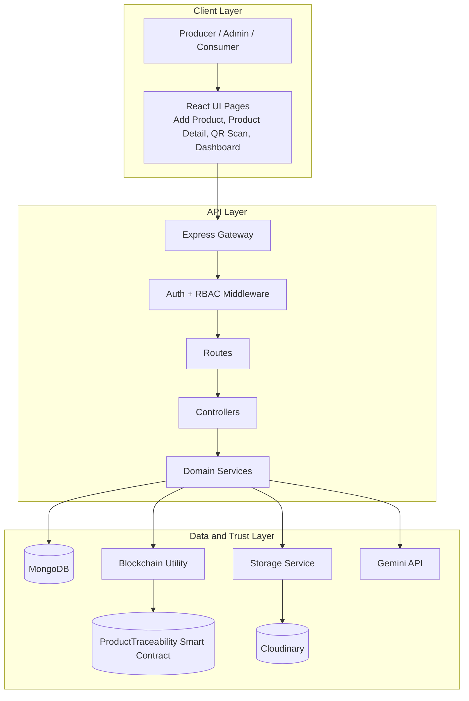
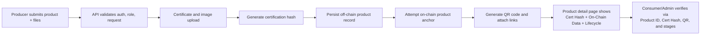
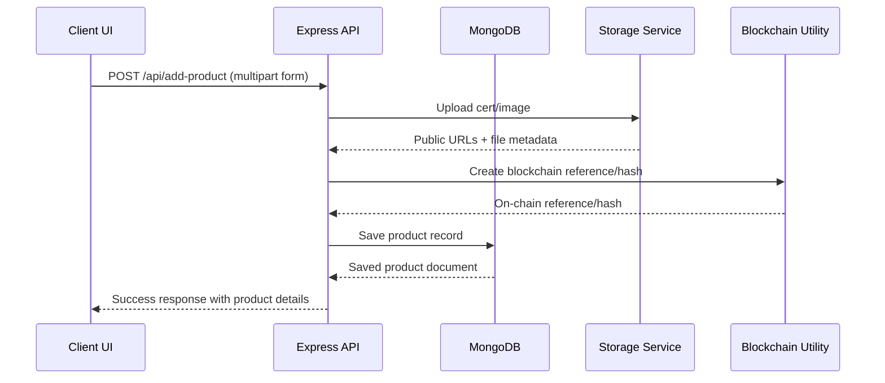
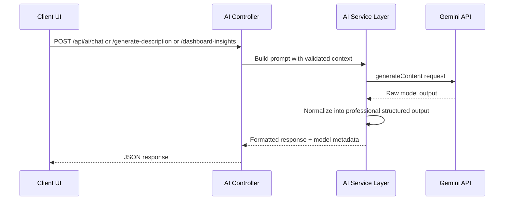

# Product Traceability Platform

Enterprise-grade product traceability platform that combines blockchain-backed records, secure APIs, a modern React frontend, and AI-assisted operational insights.

The system is designed for producer-driven product lifecycle tracking, certificate proofing, QR-based verification, and role-based access control. It supports real-world workflows from product registration to post-distribution validation.

---

## Table of Contents

1. Executive Summary
2. Business Problem and Solution
3. Product Capabilities
4. System Architecture
5. End-to-End Request Flow
6. Technology Stack
7. Repository Structure (Current)
8. Environment Variables
9. Local Development Setup
10. Runbook and Scripts
11. API Surface
12. Security and Reliability
13. AI Response Formatting Strategy
14. Deployment Notes
15. Troubleshooting
16. Roadmap Recommendations

---

## 1. Executive Summary

Product Traceability Platform enables organizations to:

- Register and manage products with immutable blockchain references.
- Track lifecycle stages (for example: Harvested, Processed, Packaged, Shipped, Delivered).
- Generate and distribute QR codes for quick product verification.
- Store media and certificates in cloud storage.
- Surface live operational metrics for administrators and producers.
- Use Gemini-powered AI for product chat, product description generation, and dashboard insight summaries.

This implementation is optimized for fast iteration in development and controlled operation in production.

---

## 2. Business Problem and Solution

### Problem

Supply chains often struggle with fragmented product records, weak authenticity proofs, and delayed operational visibility.

### Solution

This platform unifies traceability data into one system:

- Off-chain operational data is stored in MongoDB.
- On-chain anchors provide immutable proof references.
- QR scans bridge physical products and digital records.
- AI endpoints provide structured, professional analysis for users and admins.

### Expected Outcomes

- Faster verification of product authenticity.
- Better trust for downstream stakeholders and consumers.
- Improved operational decision-making through centralized stats and insights.

---

## 3. Product Capabilities

### Core Platform

- Role-based authentication and authorization.
- Producer-focused product creation and updates.
- Product profile with origin, manufacturer, stages, and certificate hash.
- QR generation per product with reusable public URL metadata.
- Dashboard metrics for scans, updates, and product counts.

### AI Capabilities (Gemini-backed)

- Product Chat: Ask contextual questions against live product data.
- Description Generator: Produce polished product descriptions from keywords and tone.
- Dashboard Insights: Generate executive summaries and action points from current view state.

### AI Output Quality Layer

AI responses are generated by Gemini and then normalized at backend level into professional sections and bullet points for consistency.

---

## 4. System Architecture

### 4.1 High-Level Architecture Diagram



### 4.2 Backend Component View



### 4.3 Architecture in Words

The platform follows a layered architecture where the React client acts as the presentation layer, the Express server acts as the orchestration and policy layer, and MongoDB plus blockchain form the persistence and trust layers.

At runtime, a user action starts in the client application, which sends authenticated REST requests to backend endpoints. The backend routes delegate to controllers, controllers apply validation and authorization, and then call service modules for domain operations such as AI generation, file storage, QR generation, hashing, and blockchain interactions.

Product master data, metadata, lifecycle stages, certificate references, and QR metadata are stored in MongoDB for fast query and dashboard use cases. In parallel, blockchain utilities write and read immutable product anchors on-chain (for example product identity, origin, manufacturer, certification hash, timeline markers) to provide tamper-evident traceability.

For file handling, uploaded assets such as certificates and product images are processed by the storage abstraction layer and persisted in cloud storage. The persisted file references are then attached to product records, enabling both document retrieval and verification workflows in product-detail pages.

For verification UX, the client renders three trust surfaces together: off-chain record details from MongoDB, on-chain data from smart contracts, and certificate/document links from storage. This design gives users both operational context and cryptographic traceability in one view.

For AI capabilities, the backend builds context-aware prompts from live product or dashboard data, calls Gemini APIs, and normalizes model output into professional structured sections before returning responses. This keeps outputs consistent and user-facing quality high while still using real model-generated content.

Security is enforced through token-based authentication, role and permission checks, and route-level controls for sensitive operations. Performance and reliability are supported by API rate limiting, health checks, and separation of concerns across route, controller, service, and utility layers.

### 4.4 Diagrammatic Architecture (Detailed)



### 4.5 Product Verification Pipeline (Diagram)



### 4.6 Architecture (ASCII View)

```text
Users --> React Client --> Express API --> Controllers/Services
                                 |--> MongoDB (product records, stages, refs)
                                 |--> Cloudinary (certificate/image/QR assets)
                                 |--> Blockchain (immutable product anchors)
                                 |--> Gemini API (AI chat, descriptions, insights)

Verification surfaces in UI:
1) Off-chain product record
2) On-chain product data
3) Certificate and QR references
```

---

## 5. End-to-End Request Flow

### 5.1 Product Registration Flow



### 5.2 AI Insight Flow



---

## 6. Technology Stack

### Frontend

- React 18
- React Router 6
- Tailwind CSS
- Framer Motion, GSAP, React Spring
- html5-qrcode and jsQR
- React App Rewired

### Backend

- Node.js + Express 4
- MongoDB + Mongoose 8
- JWT authentication
- Helmet, CORS, rate limiting
- Multer for file uploads
- Cloudinary integration
- QR code generation

### Blockchain

- Solidity smart contract(s)
- Hardhat toolchain
- Ethers.js
- Sepolia network integration

### AI

- Gemini generateContent API
- Gemini model preference:
  - gemini-2.5-flash-lite
  - gemini-2.5-flash
- Backend response formatter for consistent enterprise-style output

---

## 7. Repository Structure (Current)

The structure below reflects the current workspace organization.

```text
product-tracibility/
├── package.json
├── README.md
├── artifacts/
│   └── contracts/
│       └── ProductTraceability.sol/
├── cache/
├── contracts/
│   ├── ProductTraceability.sol
│   └── ProductTraceability.abi.json
├── scripts/
│   ├── deploy.js
│   ├── fix-all-errors.js
│   ├── restart-clean.js
│   ├── setup-mongodb-quick.js
│   └── start-mongodb.js
├── client/
│   ├── package.json
│   ├── config-overrides.js
│   ├── postcss.config.js
│   ├── tailwind.config.js
│   ├── public/
│   ├── build/
│   └── src/
│       ├── App.js
│       ├── index.js
│       ├── index.css
│       ├── setupProxy.js
│       ├── setupProxy_manual.js
│       ├── components/
│       │   ├── APIStatusIndicator.js
│       │   ├── BackendConnectionStatus.js
│       │   ├── CertificateViewer.js
│       │   ├── ProductSearch.js
│       │   ├── PerformanceMonitor.js
│       │   ├── Navbar.js
│       │   ├── Layout.js
│       │   ├── ErrorBoundary.js
│       │   ├── OptimizedImage.js
│       │   ├── 3D/
│       │   └── UI/
│       ├── hooks/
│       │   └── useRealTimeStats.js
│       ├── pages/
│       │   ├── Home.js
│       │   ├── Landing.js
│       │   ├── AddProduct.js
│       │   ├── UpdateProduct.js
│       │   ├── UpdateProductNew.js
│       │   ├── ProductDetail.js
│       │   ├── QRScan.js
│       │   ├── AdminDashboard.js
│       │   ├── UserProfile.js
│       │   ├── AuthLogin.js
│       │   └── AuthRegister.js
│       ├── styles/
│       └── utils/
│           ├── apiConfig.js
│           ├── enhancedApiConfig.js
│           ├── apiTest.js
│           ├── lazyLoading.js
│           ├── performanceOptimizations.js
│           ├── reactUtils.js
│           └── webSocketManager.js
└── server/
    ├── package.json
    ├── README.md
    ├── index.js
    ├── seedDatabase.js
    ├── middleware/
    │   ├── auth.js
    │   └── enhancedAuth.js
    ├── models/
    │   ├── Product.js
    │   ├── User.js
    │   └── controllers/
    │       ├── authController.js
    │       ├── productController.js
    │       ├── profileController.js
    │       └── statisticsController.js
    ├── routes/
    │   ├── authRoutes.js
    │   ├── productRoutes.js
    │   ├── profileRoutes.js
    │   ├── statisticsRoutes.js
    │   └── aiRoutes.js
    ├── services/
    │   ├── cloudinaryService.js
    │   ├── storageFactory.js
    │   └── ai/
    │       ├── geminiClient.js
    │       ├── responseFormatter.js
    │       ├── chatService.js
    │       ├── descriptionService.js
    │       └── dashboardService.js
    ├── qr/
    │   └── generateQR.js
    └── utils/
        ├── blockchain.js
        ├── hash.js
        └── role.js
```

---

## 8. Environment Variables

### 8.1 Server Environment

Create server/.env and configure:

```env
MONGODB_URI=...
JWT_SECRET=...
PORT=5000
NODE_ENV=development

# blockchain
CONTRACT_ADDRESS=...
SEPOLIA_RPC_URL=...
# the server only builds unsigned transaction payloads; wallets sign them on the client

# storage
STORAGE_TYPE=cloudinary
CLOUDINARY_CLOUD_NAME=...
CLOUDINARY_API_KEY=...
CLOUDINARY_API_SECRET=...
```

For product registration and stage updates, the server now returns a wallet-signable transaction request and stores pending blockchain metadata in MongoDB. After the user signs and broadcasts the transaction in MetaMask or another wallet, post the mined receipt back to the API so the record can be marked confirmed.

Optional but implemented:

```env
# admin bootstrap
ADMIN_BOOTSTRAP_ENABLED=true
ADMIN_BOOTSTRAP_EMAIL=admin@producttraceability.local
ADMIN_BOOTSTRAP_PASSWORD=...
ADMIN_BOOTSTRAP_SECRET=... # min 32 chars
ADMIN_BOOTSTRAP_ROTATE_PASSWORD=false
ALLOW_ADMIN_REGISTRATION=false

# AI
GEMINI_API_KEY=...
GEMINI_MODEL=gemini-2.5-flash-lite
GEMINI_TIMEOUT_MS=15000
AI_RATE_LIMIT_WINDOW_MS=900000
AI_RATE_LIMIT_MAX=20

# auth logging (disabled by default)
AUTH_DEBUG_LOGS=false
```

## Run Locally

Backend:

```bash
cd server
npm run dev
```

Frontend:

```bash
cd client
npm start
```

Production backend mode (local check):

```bash
cd server
npm run prod
```

Client build:

```bash
cd client
npm run build
```

## Active Backend Routes

Base routes mounted from `server/index.js`:

- `/api` -> product routes
- `/api/auth` -> auth routes
- `/api/profile` -> profile routes
- `/api/statistics` -> statistics routes
- `/api/ai` -> AI routes
- `/api/admin` -> admin routes

Health and utility:

- `GET /api/health`
- `GET /api/db-test`
- `GET /api/statistics/test`
- `GET /api/statistics/stats` (debug summary)
- `GET /product/:id` (anonymous deep-link fallback for QR)

Authentication:

- `POST /api/auth/register`
- `POST /api/auth/login`

Products:

- `POST /api/add-product` (producer + permission)
- `POST /api/update-product/:id` (producer/admin + permission; ownership rules enforced in controller)
- `GET /api/product/:id`
- `GET /api/products`
- `GET /api/my-products`
- `GET /api/recent-products`
- `GET /api/product/by-cert-hash/:certHash`
- `GET /api/product/:id/qr`

Profile:

- `GET /api/profile`
- `PUT /api/profile`
- `GET /api/profile/stats`

Statistics:

- `GET /api/statistics/stats`
- `GET /api/statistics/dashboard`
- `POST /api/statistics/scan/:productId`

AI:

- `GET /api/ai/health`
- `POST /api/ai/chat`
- `POST /api/ai/generate-description`
- `POST /api/ai/dashboard-insights`

Admin:

- `GET /api/admin/overview`
- `GET /api/admin/products/flagged`
- `GET /api/admin/product/:id`
- `POST /api/admin/product/:id/action`

## Pagination Support (Backward-Compatible)

Implemented for heavy list endpoints:

- `GET /api/products`
- `GET /api/my-products`

Behavior:

- Without query params: returns legacy array response.
- With `page` or `limit`: returns object with `data` and `pagination`.

Example:

```http
GET /api/products?page=1&limit=20
```

## Security and Auth Notes

- JWT required for protected routes.
- Admin bootstrap is env-driven and runs after Mongo connection.
- Public admin registration is blocked unless explicitly enabled.
- Secondary auth checks are implemented for sensitive operations.

## QR and Transparency Flow

Current flow:

1. Product created or updated
2. Blockchain tx stored (`blockchainTx`) and event records maintained (`blockchainEvents`)
3. QR generated via `/api/product/:id/qr`
4. QR points to `/product/:id`
5. Backend deep-link serves client app (or redirects to `CLIENT_APP_URL` fallback)

## Smoke Testing

Ledger transparency smoke script:

```bash
cd server
npm run test:smoke:ledger
```

Required env for smoke script:

```env
SMOKE_BASE_URL=http://localhost:5000
LEDGER_SMOKE_EMAIL=...
LEDGER_SMOKE_PASSWORD=...
LEDGER_SMOKE_PRODUCT_ID=...
LEDGER_SMOKE_RUN_UPDATE=false
```

## Current Known Implementation Notes

- `server/nodemon.json` is configured to avoid restart storms by ignoring non-server paths.
- API latency logging is enabled for `/api/*` routes in backend runtime logs.
- AI/admin modules and verification services are restored and load correctly.

## Root Scripts (Blockchain/Deployment Helpers)

From repository root:

```bash
npm run deploy-contract
npm run verify-contract
npm run test-blockchain
npm run validate-deployment
npm run setup-deployment
```

### Server Scripts

```bash
cd server
npm start
npm run dev
npm run prod
npm run test:ai
npm run analyze
npm run monitor
npm run cluster
```

### Client Scripts

```bash
cd client
npm start
npm run build
npm run build:enhanced
npm run build:prod
npm run preview
npm run lighthouse
```

---

## 11. API Surface

### Authentication

- POST /api/auth/register
- POST /api/auth/login

### Products

- POST /api/add-product
- POST /api/update-product/:id
- GET /api/product/:id
- GET /api/products
- GET /api/my-products
- GET /api/recent-products
- GET /api/product/by-cert-hash/:certHash
- GET /api/product/:id/qr

### Profile

- GET /api/profile
- PUT /api/profile
- GET /api/profile/stats

### Statistics

- GET /api/statistics/test
- GET /api/statistics/stats
- GET /api/statistics/stats (route module protected endpoint)
- GET /api/statistics/dashboard
- POST /api/statistics/scan/:productId

### AI

- GET /api/ai/health
- POST /api/ai/chat
- POST /api/ai/generate-description
- POST /api/ai/dashboard-insights

All AI endpoints require auth and are rate-limited.

---

## 12. Security and Reliability

### Security Controls

- JWT-based auth middleware.
- Role and permission checks for sensitive operations.
- Helmet headers and controlled CORS policy.
- Request size limits and upload size caps.
- Rate limiting in production and dedicated AI limiter.

### Reliability Controls

- Mongo connection diagnostics via /api/db-test.
- Fallback-safe startup flow with connection status logging.
- API health endpoint for service checks.
- Retry-aware client-side API helper.

---

## 13. AI Response Formatting Strategy

AI quality in this platform follows a two-layer strategy:

1. Prompt Contract Layer
- The backend prompts Gemini to return strict JSON schema for each AI capability.

2. Output Normalization Layer
- Backend formatter converts model output to professional, readable sections.
- Outputs are normalized into clear headings and bullet points.
- This avoids inconsistent raw markdown and improves UI readability.

Result: responses remain Gemini-generated while presentation is enterprise-ready.

---

## 14. Deployment Notes


### Production Checklist

- Set NODE_ENV=production.
- Use strong JWT secret and rotated credentials.
- Restrict CORS to official frontend domains.
- Set stable Gemini model and quotas.
- Add observability (logs, uptime checks, alerts).

---

## 15. Troubleshooting

### API Not Reachable

- Confirm backend is running on expected port.
- Confirm proxy/base URL configuration from client.
- Check CORS policy for current frontend origin.

### Database Issues

- Validate MONGODB_URI and network allowlist.
- Use /api/db-test for diagnostics.

### AI Endpoint Failures

- Verify GEMINI_API_KEY and model availability.
- Check AI rate limit env values.
- Inspect server logs for model-specific quota errors.

### Upload Problems

- Verify Cloudinary keys.
- Check max upload size and content type.

---

